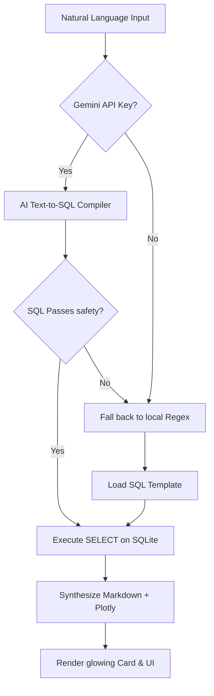

# 📐 Skylark Drones BI Agent — Architecture Manual

> **This document details the software architecture, data resilience pipelines, caching schemas, and AI orchestration routines implemented in the Skylark Drones BI Agent.**

---

## 1. High-Level Architecture Overview

The system is split into three main layers: **Data Resilience (Ingestion)**, **Relational Caching (Storage)**, and **AI/Fallback Orchestration (Execution)**.

```
┌──────────────────────────────────────────────────────────────────────────────┐
│                            1. INGESTION PIPELINE                             │
│       PDF table split coordinate alignments -> CSV clean files               │
└──────────────────────────────────────┬───────────────────────────────────────┘
                                       │ (Seed & Sync)
                                       ▼
┌──────────────────────────────────────────────────────────────────────────────┐
│                              2. RELATIONAL CACHE                             │
│                  SQLite cached storage backend/skylark.db                    │
└──────────────────────────────────────┬───────────────────────────────────────┘
                                       │ (Read-Only SELECTs)
                                       ▼
┌──────────────────────────────────────────────────────────────────────────────┐
│                           3. QUERY INTERCEPT ROUTER                          │
│               Safe SQLite queries execution -> Plotly generation              │
└──────────────────────────────────────────────────────────────────────────────┘
```

---

## 2. Data Ingestion & Resilience Pipeline (`reconstruct_data.py`)

Raw data exists as coordinate PDF tables horizontally split across multiple sheets. The alignment pipeline parses these tables using index and spatial alignments:

```
               PDF Ingestion Bounding-Box Alignments
               
  Page 1 (Columns 1-4)                  Page 10 (Columns 5-8)
┌──────────────────────────┐          ┌──────────────────────────┐
│  Row 1: [ID] [Client]    │          │  Row 1: [PO] [Status]    │
│  Row 2: [ID] [Client]    │          │  Row 2: [PO] [Status]    │
└────────────┬─────────────┘          └────────────┬─────────────┘
             │                                     │
             │         Spatial Row Matching        │
             ▼                                     ▼
         [Row Index Match]                     [Row Index Match]
             │                                     │
             └─────────────────► ┌───────────┐ ◄───┘
                                 │ Merged    │
                                 │ Row Table │
                                 └─────┬─────┘
                                       │
                                       ▼
                          Relational SQLite Database Seeding
```

### Table Structure & SQLite Schemas

#### 1. `deals` table
Houses pipeline, client categorization, and sales values:
```sql
CREATE TABLE IF NOT EXISTS deals (
    deal_name TEXT,
    owner_code TEXT,
    client_code TEXT,
    deal_status TEXT CHECK(deal_status IN ('Open', 'Won', 'Dead', 'On Hold')),
    masked_deal_value REAL,
    closure_probability TEXT CHECK(closure_probability IN ('High', 'Medium', 'Low')),
    sector_service TEXT,
    deal_stage TEXT,
    product_deal TEXT,
    created_date TEXT,
    tentative_close_date TEXT,
    close_date_actual TEXT
);
CREATE INDEX IF NOT EXISTS idx_deals_status ON deals(deal_status);
CREATE INDEX IF NOT EXISTS idx_deals_sector ON deals(sector_service);
```

#### 2. `work_orders` table
Tracks delivery status, contract billing progress, and receivables:
```sql
CREATE TABLE IF NOT EXISTS work_orders (
    serial_num TEXT PRIMARY KEY,
    customer_name_code TEXT,
    nature_of_work TEXT,
    execution_status TEXT,
    amount_excl_gst REAL,
    billed_excl_gst REAL,
    amount_receivable REAL,
    billing_status TEXT,
    invoice_status TEXT,
    bd_kam_personnel_code TEXT,
    sector TEXT,
    type_of_work TEXT
);
CREATE INDEX IF NOT EXISTS idx_wos_execution ON work_orders(execution_status);
```

---

## 3. Query Resolution Pipeline



### A. SQL Safety Boundary Filter
Before query execution, `is_safe_sql` checks for unauthorized structures:
```python
def is_safe_sql(sql_query: str) -> bool:
    clean = sql_query.strip().upper()
    if not clean.startswith("SELECT"):
        return False
    # Strict read-only query check
    forbidden = ["INSERT", "UPDATE", "DELETE", "DROP", "ALTER", "REPLACE", "CREATE", "TRUNCATE", "RENAME", "GRANT", "REVOKE"]
    for f in forbidden:
        if re.search(rf"\b{f}\b", clean):
            return False
    return True
```

### B. Gemini Prompts & Synthesis
The AI orchestrator leverages:
- **`call_gemini_sql`**: Feeds the query, database schema definitions, and conversation memory to produce clean SQL syntax.
- **`call_gemini_synthesis`**: Feeds the query, SQL statement, and returned JSON dataset to produce markdown copy, interactive Plotly layout attributes, and proactive advice metadata.

---

## 4. Monday.com GraphQL Real-Time Sync (`monday_client.py`)

```
               Real-Time Monday.com Sync Flow
               
  ┌──────────────────┐               ┌──────────────────┐
  │   Monday.com     │               │  SQLite Cache    │
  │   GraphQL API    │               │  (skylark.db)    │
  └────────┬─────────┘               └────────▲─────────┘
           │                                  │
           │ (GraphQL Queries)                │
           ▼                                  │
  ┌──────────────────┐                        │
  │   GraphQL Client ├────────────────────────┘
  │ (monday_client)  │   (Update SQLite Deals & WOs tables)
  └──────────────────┘
```

*Note: If no connection tokens are provided, the GraphQL Client falls back to using the seeded relational SQLite database cache seamlessly.*
