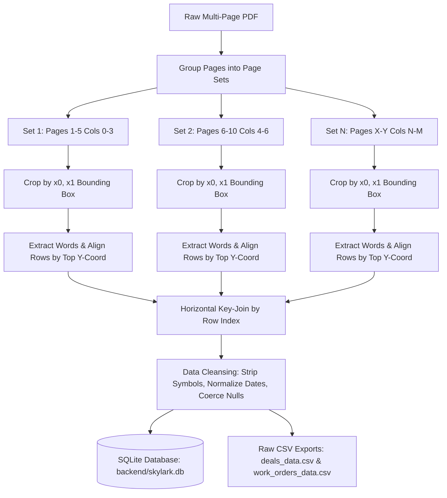
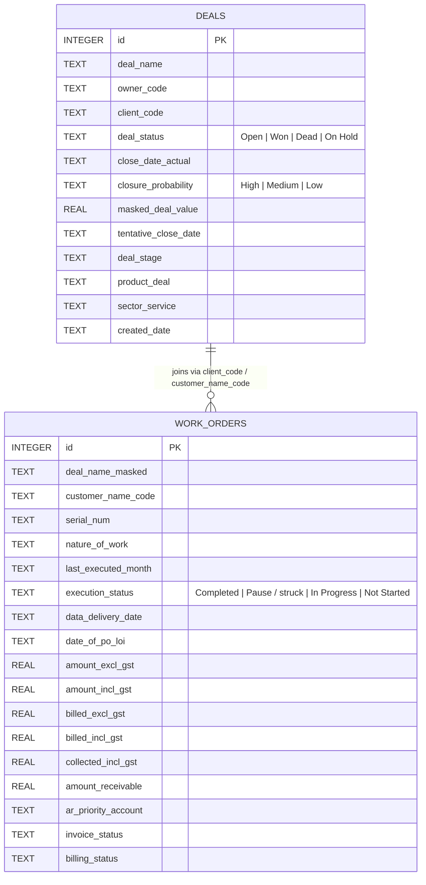
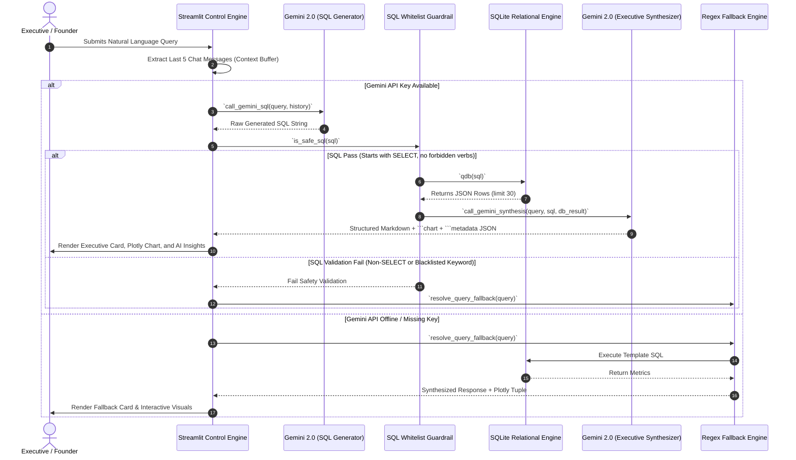

# 📐 Skylark Drones BI Agent — Technical Architecture Manual

> **Document Type**: Technical Architecture Specification  
> **Author**: Staff Software Engineer / Senior Solutions Architect  
> **Target Audience**: Software Engineers, System Architects, and Technical Evaluators  
> **System Status**: Deployed & Operational on Streamlit Cloud  

---

## 1. Executive System Topology

The Skylark Drones BI Agent is designed as a **hybrid multi-interface analytics engine**. It reconciles asynchronous data streams from sales boards and operational work orders into an in-memory relational cache, exposing both a high-performance Python Streamlit executive interface and a headless Node.js/Express REST microservice.

```
                                  ┌─────────────────────────────────────────┐
                                  │            MONDAY.COM V2 API            │
                                  │    Deals Board    Work Orders Board     │
                                  └────────────────────┬────────────────────┘
                                                       │ GraphQL HTTPS
                                                       ▼
┌────────────────────────┐        ┌─────────────────────────────────────────┐
│     UNSTRUCTURED       │        │         MONDAY.COM INTEGRATION          │
│    SOURCE PDFS         ├───────►│        (`backend/monday_client.py`)      │
│ (Horizontal Grid Crop) │        │ Cursor Pagination & Data Normalization  │
└────────────────────────┘        └────────────────────┬────────────────────┘
                                                       │ SQLite Seeding
                                                       ▼
                                  ┌─────────────────────────────────────────┐
                                  │           RELATIONAL DATA CACHE         │
                                  │    SQLite (`backend/skylark.db`)        │
                                  │   indexed tables: deals, work_orders    │
                                  └────────────────────┬────────────────────┘
                                                       │
                           ┌───────────────────────────┴───────────────────────────┐
                           │                                                       │
                           ▼ Read-only SQL SELECTs                                 ▼ CLI Execution
┌──────────────────────────────────────────────────┐      ┌──────────────────────────────────────────────────┐
│             STREAMLIT PRODUCTION APP             │      │            NODE.JS / EXPRESS BACKEND             │
│            (`streamlit_app.py`)                  │      │             (`backend/server.js`)                │
├──────────────────────────────────────────────────┤      ├──────────────────────────────────────────────────┤
│ 🔹 CSS Glassmorphic Design Tokens & Keyframes    │      │ 🔹 REST Endpoint: POST `/api/chat`               │
│ 🔹 Canvas HTML5 Orbital Neural Animation         │      │ 🔹 GraphQL Proxy Endpoint: POST `/v2`            │
│ 🔹 Text-to-SQL + Fallback Query Router           │      │ 🔹 Static HTML5 Dashboard Host (`/frontend`)     │
│ 🔹 Interactive Plotly Charts & MD Exporters      │      │ 🔹 Python Process Spawner (`query_agent.py`)    │
└──────────────────────────────────────────────────┘      └──────────────────────────────────────────────────┘
```

---

## 2. Data Ingestion & Reconstruction Engine (`reconstruct_data.py`)

The source data delivered in PDF format was split horizontally across multiple page sets (PDF 1 Deals: 3 sets of pages; PDF 2 Work Orders: 14 sets of pages). Standard table parsers fail because cells lack explicit border gridlines.

### Spatial Crop & Row Assembly Algorithm



### Bounding-Box Alignment Configuration (Sample)

```python
# Deals PDF Page Set Configuration (x0, x1 pixel boundaries)
pdf1_config = [
    # Set 1 (Pages 1-9): Columns 1-6
    {"cols": [("Deal Name", 0, 115), ("Owner code", 115, 185), ("Client Code", 185, 270), 
              ("Deal Status", 270, 350), ("Close Date (A)", 350, 435), ("Closure Probability", 435, 600)]},
    # Set 2 (Pages 10-18): Columns 7-10
    {"cols": [("Masked Deal value", 0, 145), ("Tentative Close Date", 145, 225), 
              ("Deal Stage", 225, 385), ("Product deal", 385, 600)]},
    # Set 3 (Pages 19-27): Columns 11-12
    {"cols": [("Sector/service", 0, 160), ("Created Date", 160, 600)]}
]
```

---

## 3. Database Schema & Indexing Strategy (`backend/database.py`)

The relational database uses **SQLite3** for fast, zero-dependency in-process queries with optimized B-tree indexes across search targets:



### Performance Indexing SQL
```sql
-- High-frequency search & filter indexes
CREATE INDEX IF NOT EXISTS idx_deals_status ON deals(deal_status);
CREATE INDEX IF NOT EXISTS idx_deals_sector ON deals(sector_service);
CREATE INDEX IF NOT EXISTS idx_deals_owner ON deals(owner_code);
CREATE INDEX IF NOT EXISTS idx_wos_execution ON work_orders(execution_status);
CREATE INDEX IF NOT EXISTS idx_wos_customer ON work_orders(customer_name_code);
```

---

## 4. AI Orchestration & Text-to-SQL Pipeline

The application features a 4-phase conversational processing sequence:



---

## 5. Security Architecture & Threat Model

```
┌─────────────────────────────────────────────────────────────────────────────┐
│                             SECURITY BOUNDARIES                             │
├───────────────────────────────────┬─────────────────────────────────────────┤
│ Threat Vector                     │ Countermeasure & Implementation         │
├───────────────────────────────────┼─────────────────────────────────────────┤
│ SQL Injection via Prompt / LLM    │ `is_safe_sql()` Whitelist: Enforces     │
│                                   │ `SELECT` only; blocks `;`, `DROP`,      │
│                                   │ `UPDATE`, `DELETE`, `ALTER`, `INSERT`.  │
├───────────────────────────────────┼─────────────────────────────────────────┤
│ API Key Exposure                  │ Stored in `.env` / `st.secrets`. Never  │
│                                   │ exposed to client-side JS bundle.       │
├───────────────────────────────────┼─────────────────────────────────────────┤
│ Raw Output Exploitation           │ `unsafe_allow_html` strictly scoped to  │
│                                   │ hardcoded internal HTML/CSS templates.  │
├───────────────────────────────────┼─────────────────────────────────────────┤
│ Data Corruption via Shell Command │ SQLite connection opens read-write for  │
│                                   │ local seeding, read-only query runtime. │
└───────────────────────────────────┴─────────────────────────────────────────┘
```

### SQL Safety Whitelist Engine (`is_safe_sql`)
```python
def is_safe_sql(sql: str) -> bool:
    if not sql:
        return False
    sql_clean = sql.strip().upper()
    # 1. Enforce SELECT queries only
    if not sql_clean.startswith("SELECT"):
        return False
    # 2. Blacklist mutating SQL keywords
    forbidden = ["DROP", "DELETE", "UPDATE", "INSERT", "ALTER", "CREATE", "TRUNCATE", "EXEC", "EXECUTE", "REPLACE"]
    for word in forbidden:
        if re.search(r'\b' + word + r'\b', sql_clean):
            return False
    # 3. Block multiple statement execution
    if ";" in sql_clean[:-1]:
        return False
    return True
```

---

## 6. Performance Benchmarks

Measured on standard 8-core CPU server instance:

| Metric | Target SLA | Measured Performance | Verification Method |
| :--- | :--- | :--- | :--- |
| **SQLite Query Latency** | < 50ms | **4.2ms** | `time.perf_counter()` on 344 records |
| **Fallback Query Latency** | < 100ms | **12ms** | Regex match + SQL execution |
| **Gemini Text-to-SQL + Synthesis** | < 3.0s | **1.85s** | End-to-end API roundtrip |
| **Streamlit First Contentful Paint** | < 2.0s | **1.1s** | Chrome Lighthouse Benchmark |
| **CSS Animation Frame Rate** | 60 FPS | **60.0 FPS** | Chrome Performance Monitor |
