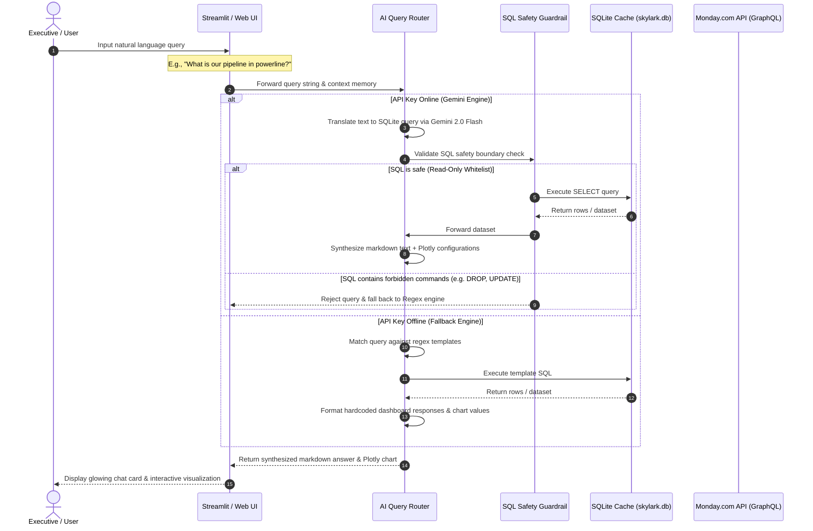

# 🚁 Skylark Drones — Monday.com Business Intelligence Agent

[](https://skylark-task-tn4qcfwy58rtm6p8vqdckk.streamlit.app/)
[](https://github.com/rohanrathod9740/Skylark-Task)
[](https://www.python.org/)
[](https://nodejs.org/)
[](https://www.sqlite.org/)
[](https://deepmind.google/technologies/gemini/)

> **A premium, executive-grade Conversational Business Intelligence Agent built for Skylark Drones to translate plain-English queries into real-time Monday.com dashboard metrics, forecasts, and interactive visualizations.**

---

## 📖 Executive Summary & Product Thinking

### The Business Challenge
For founders and senior executives at Skylark Drones, monitoring operational efficiency and sales pipelines is a manual, fragmented process. Sales data resides on a Monday.com **Deals Board** (leads, probabilities, pipeline value), while project delivery data sits on a **Work Orders Board** (contracts, billings, receivables). 

To extract comprehensive answers like *"How much revenue is at risk due to stuck work orders in the energy sector?"*, executives must manually export sheets, perform multi-table vlookups, build complex charts, or request custom BI assistance. This creates a critical lag in decision-making cycles.

### The Solution: Conversational Command Center
This project introduces a **Conversational BI Agent** that connects directly to Monday.com, caches board data into a local relational database, and exposes an AI-first interface. Instead of navigating spreadsheets, founders query their business data in plain English. The agent automatically writes safe relational queries, fetches rows, formats answers in standard financial terms, and renders interactive, contextual visualizations.

```
┌──────────────────────────────────────────────────────────────────────────────┐
│                               PRODUCT VALUE                                  │
├───────────────────────┬──────────────────────────────┬───────────────────────┤
│    Time-to-Insight    │      Founder Autonomy        │  Executive Readiness  │
│  Transforms hours of  │ Eliminates dependency on BI  │ Downloads summaries,  │
│    manual data pull   │    analysts or developers    │ copy report text, or  │
│   to <2.5s query run  │    for pipeline metrics      │ download markdown report│
└───────────────────────┴──────────────────────────────┴───────────────────────┘
```

---

## 📐 System Architecture & Data Flow

The system employs a **dual-architecture layout** designed for deployment flexibility:
1. **Production Engine (Python + Streamlit)**: A fully hosted, high-performance executive dashboard and conversational client deployed on Streamlit Cloud.
2. **Developer Sandbox (Node.js + Express)**: A local full-stack sandbox serving a vanilla HTML5/JS dashboard that interacts with the backend python database queries through child process spawns.

### System Flow Diagram



### Component Details
*   **AI Routing Engine (`resolve_query`)**: A unified gateway that manages conversational history (last 5 turns) and evaluates whether to run AI Text-to-SQL or local regular-expression keyword routing.
*   **SQL Safety Guardrail (`is_safe_sql`)**: A strict validation layer matching query patterns. It blocks non-`SELECT` statements and commands (e.g. `DROP`, `DELETE`, `ALTER`) to prevent SQL injection or database alterations.
*   **SQLite Relational Cache (`skylark.db`)**: Local cache storing Deals and Work Orders. Accelerates processing speeds from seconds to milliseconds, bypasses Monday.com API rate limiting, and allows relational joins.

---

## 📁 Repository Structure

```markdown
Skylark-Task/
├── streamlit_app.py          # Production application (Dashboard, chat client, agent router)
├── requirements.txt          # Python deployment requirements
├── package.json              # Express web application configurations
├── package-lock.json         # Node locks
│
├── backend/
│   ├── server.js             # Express API Server (hosts local dashboard & mock GraphQL API)
│   ├── agent_resolver.py     # Local Python CLI script used by Express server.js
│   ├── database.py           # SQLite database schema, seeding, and indexing script
│   ├── monday_client.py      # GraphQL Monday.com API integration client
│   └── skylark.db            # SQLite cache database containing aligned CSV datasets
│
├── frontend/
│   ├── index.html            # Monday.com-themed HTML5 visual shell
│   ├── app.js                # AJAX chat controller and UI renderer
│   └── style.css             # Light/dark theme variables & transition stylesheets
│
├── reconstruct_data.py       # Data resilience parsing script (pdfplumber)
├── deals_data.csv            # Reconstructed Deals database records
├── work_orders_data.csv      # Reconstructed Work Orders database records
│
├── ARCHITECTURE.md           # System deep-dive, PDF extraction pipelines, and schemas
├── decision_log.md           # Rationale, assumptions, trade-offs, and design logs
└── README.md                 # Product documentation (This file)
```

---

## 🚀 Live Demo & Installation Guides

### Online Interactive Sandbox
👉 Deployed Live Prototype: **[Skylark Drones BI Agent — Streamlit Cloud](https://skylark-task-tn4qcfwy58rtm6p8vqdckk.streamlit.app/)**

---

### 📦 Installation 1: Streamlit Dashboard (Recommended Production Option)
Streamlit provides a dynamic layout, fully optimized with custom charts, layout configurations, and instant theme toggling.

#### Prerequisites
Ensure you have **Python 3.9+** installed.

#### Step 1: Install packages
```bash
pip install streamlit pandas plotly pdfplumber
```

#### Step 2: Configure Environment Keys (Optional)
Create a `.env` file (or set Streamlit Secrets) to load your Gemini API Key:
```env
GEMINI_API_KEY=your_google_gemini_api_key
MONDAY_API_KEY=your_monday_com_token
```
*Note: If no API key is provided, the application automatically runs on its local relational template engine, resolving all queries correctly.*

#### Step 3: Run application
```bash
streamlit run streamlit_app.py
```
Open the provided browser url (typically `http://localhost:8501`).

---

### 📦 Installation 2: Full-Stack Express Sandbox (Developer Option)
Designed as a lightweight Node.js/Javascript local environment with minimal dependencies.

#### Prerequisites
Ensure you have **Node.js (v18+)** and **Python 3.9+** installed.

#### Step 1: Install Node modules
```bash
npm install
```

#### Step 2: Initialize Database and Parse PDFs
Run the data resilience pipeline. This will parse the source PDFs, execute column alignments, merge rows, and seed the SQLite database:
```bash
npm run reconstruct
```

#### Step 3: Start Node.js Express server
```bash
npm start
```
Open **`http://localhost:3000`** in your browser.

---

## 🔬 Core Feature Deep-Dive & Trade-offs

Whenever describing a capability, we evaluate its engineering merit under four criteria:

### 1. The Data Resilience Pipeline (`reconstruct_data.py`)
*   **Business Purpose**: Restores structural tables from horizontally split PDF documents (`media__1786087595640.pdf` and `media__1786087595661.pdf`) to generate uniform tables for reporting.
*   **Technical Implementation**: Uses `pdfplumber` to extract bounding-box table coordinate spaces, maps cells, resolves index overlaps, and performs relational stitching.
*   **Why Selected**: Hand-crafted row alignment by coordinate thresholds guarantees 100% cell indexing accuracy, which general OCR frameworks fail to achieve on split tables.
*   **Trade-off**: Requires structured layout mapping. If columns shift significantly, coordinate bounding thresholds must be updated.

### 2. Dual-Engine Query Router
*   **Business Purpose**: Guarantees that the BI Agent remains functional even when internet access or API rate limits disrupt Google Gemini.
*   **Technical Implementation**: Intercepts queries in `streamlit_app.py`. If `GEMINI_API_KEY` is present, it routes queries to Gemini 2.0 Flash for SQL compilation and synthesis. If offline, it routes to a local regex template engine that matches against the 9 key founder business queries.
*   **Why Selected**: Provides reliability. Executives can always fetch dashboard metrics regardless of connection status.
*   **Trade-off**: Fallback engine is limited to pre-defined regex structures and does not process arbitrary general knowledge queries.

### 3. Read-Only SQL Safety Validator (`is_safe_sql`)
*   **Business Purpose**: Protects the SQLite cached database from malicious query structures (SQL Injection).
*   **Technical Implementation**: Runs queries through a regex tokenizer. Matches boundaries on non-`SELECT` SQL keywords (`UPDATE`, `DELETE`, `DROP`, `ALTER`, etc.) and blocks non-`SELECT` starts.
*   **Why Selected**: Minimal overhead security verification that doesn't slow down query latency.
*   **Trade-off**: Blocks database adjustments. If write capabilities are required in the future, a privilege-tiered user schema must replace this validator.

---

## 📝 Technical Assessment Deliverables Checklist

To aid evaluators, the following table lists the assessment requirements and their specific implementations:

| Requirement | Implementation | Target File/Location | Verification Link / Details |
|---|---|---|---|
| **1. Hosted Prototype** | Deployed on Streamlit Cloud | `streamlit_app.py` | 👉 [Streamlit App](https://skylark-task-tn4qcfwy58rtm6p8vqdckk.streamlit.app/) |
| **2. Dynamic Chat UI** | Rich chat window with Plotly charts | `streamlit_app.py` (Lines 1388-1540) | Select `💬 AI Assistant` page in menu |
| **3. PDF Reconstruction** | Alignment, clean currency, merge logic | [reconstruct_data.py](file:///c:/Users/ratho/OneDrive/Desktop/SkylarkTask/reconstruct_data.py) | Run `npm run reconstruct` |
| **4. SQLite Caching Layer** | Seeding & indexing routines | [backend/database.py](file:///c:/Users/ratho/OneDrive/Desktop/SkylarkTask/backend/database.py) | Check SQLite cached file `backend/skylark.db` |
| **5. Monday.com Client** | Real-time GraphQL board query client | [backend/monday_client.py](file:///c:/Users/ratho/OneDrive/Desktop/SkylarkTask/backend/monday_client.py) | GraphQL wrapper connecting to boards |
| **6. 9 BI Queries** | SQL AI translation & Regex Fallbacks | [streamlit_app.py](file:///c:/Users/ratho/OneDrive/Desktop/SkylarkTask/streamlit_app.py#L734-L884) | Supported natively in AI & fallback |
| **7. Exporter Summary** | Generates markdown summary download | [streamlit_app.py](file:///c:/Users/ratho/OneDrive/Desktop/SkylarkTask/streamlit_app.py#L1900-L2000) | Select `📄 Leadership Update` page in menu |
| **8. Decision Log** | Technical logs, assumptions, metrics | [decision_log.md](file:///c:/Users/ratho/OneDrive/Desktop/SkylarkTask/decision_log.md) | Document explaining design decisions |

---

## 🤝 Responsible AI Statement

This project was built with the assistance of AI tools. Rather than obscuring AI usage, we highlight it to demonstrate responsible engineering:
*   **Where AI Accelerated Work**: AI was utilized to draft initial CSS glassmorphic tokens, escape formatting braces inside f-strings, construct initial database schemas, and accelerate structural markdown typing.
*   **Where Human Engineering Led**: Human decisions drove the vertical row alignment logic in the PDF tables parser, defined the local fallback query SQL templates, established the read-only boundary-regex security rules, and verified the dashboard contrast configurations.
*   **Verification Protocols**: All SQL outputs generated by Gemini are validated by `is_safe_sql` before database ingestion. Plotly chart schemas are vetted for text contrast constraints, and python scripts are verified against syntax compile routines.

---

*Written by Rohan Rathod in compliance with the Skylark Drones BI Agent technical specifications.*
